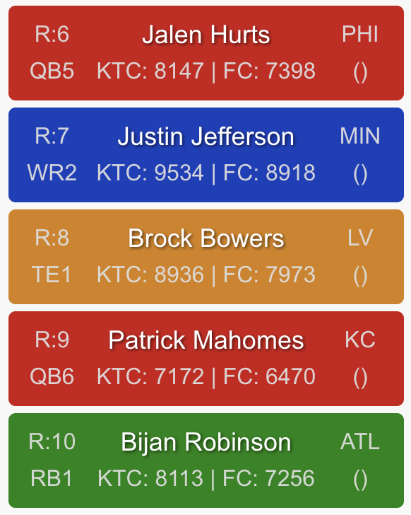

# NFL Draft Helper

NFL Draft Helper is a web application designed to assist fantasy football enthusiasts in managing their drafts, tracking player portfolios, and analyzing league data.

It has tools that can be used for both preseason, like helping with drafts and rankings, and also in season with tracking bestball placements and having injury report and values for your players gathered in one place.

An example workflow for preseason could be:

- **Create Rankings** for a scoring system you are interested in. Export the rankings as a csv.
- Go to **Settings** page and make this csv the default one for that scoring system.
- When you are in a draft of that scoring system you can access the current state of the draft with your rankings from the link in the **Draft List**
- Whenever you want to change those ranks, go back to Create rankings, this time choose Load Csv -> Start with CSV and then repeat this.

---

## Appendix: Pages in the Application

The following pages are available in the application:

1. **Create Rankings**
2. **Draft Helper**
3. **Draft List**
4. **Leagues**
5. **Bestball**
6. **Settings**

Each page is described in detail below.

---

## Create Rankings

The **Create Rankings** page allows users to create and customize their fantasy football player rankings. This page provides an intuitive drag-and-drop interface for organizing players into tiers and positions, along with an option to export the rankings as a CSV file.

### Key Features

#### Drag-and-Drop Interface:

- Players are displayed as draggable cards, grouped by position (e.g., QB, RB, WR, TE) or as an "ALL" list.
- Users can drag and drop players to reorder them within a position or move them between tiers.

#### Player Cards:

Each card contains the following player information:

- **Overall Rank**: The player's rank across all positions.
- **Name**: The player's name.
- **Position**: The player's position (e.g., QB, RB).
- **Position Rank**: The player's rank within their position.
- **Team**: The NFL team the player belongs to.
- **Bye Week**: The player's bye week.

- **Portfolio/Value**: Depending on the type of draft it will eveshow bestball Portfolio size or KTC/FC value

#### Export Rankings:

- Users can export their customized rankings as a CSV file by clicking the **Export Rankings** button.

---

## Draft Helper

The **Draft Helper** page is designed to assist users during live drafts by providing a dynamic draft board that updates in real-time. Users can start with a local CSV file or a predefined file containing player rankings and then track draft picks as they happen.

---

### Key Features

#### Choose a Rankings File:

- Users can start by selecting a local CSV file with player rankings or use a predefined file based on the draft type (e.g., dynasty, redraft).
- The rankings file is parsed to display players grouped by position and tier.

#### Sleeper Draft Integration:

- Users can input a Sleeper `draftId` to fetch live draft data.
- The draft board automatically removes players as they are picked in the Sleeper draft when refreshed.

#### Auto-Refresh:

- An auto-refresh option is available to periodically update the draft board.
- This feature is particularly useful for drafts with low pick timers.

#### Manual Pick Removal:

- Users can manually remove a player from the draft board by clicking on their card.

---

### How It Works

1. **Start with a Rankings File**:

   - Upload a local CSV file or use a predefined file based on the draft type.
   - The file is parsed to display players grouped by position (e.g., QB, RB, WR, TE) and tier.

2. **Input Sleeper Draft ID**:

   - Enter the Sleeper `draftId` in the input field to link the draft board with a live Sleeper draft.
   - The draft board fetches picks from Sleeper and removes the selected players from the list.

3. **Enable Auto-Refresh**:

   - Toggle the auto-refresh option to periodically fetch updates from Sleeper.
   - Set the refresh interval (e.g., 10, 20, 30 seconds) based on your preference.

4. **Manual Adjustments**:
   - Click on a player's card to manually remove them from the draft board.
   - This is useful for handling manual drafts or correcting errors.

---

## Draft List

The **Draft List** page provides an overview of all your ongoing drafts. It displays key information about each draft, including how many picks are left until your turn and the current timer. Additionally, it provides links to the Sleeper platform and the Draft Helper for each draft.

---

### Key Features

#### Draft Overview:

- Displays a list of all ongoing drafts, including:
  - **Draft Name**: The name of the draft.
  - **Picks Before You**: The number of picks remaining until it's your turn.
    - If it's your turn, the message "It's your turn to pick!" is highlighted in green.
    - If your last pick has been made, the message "Your last pick is made!" is highlighted in red.
  - **Round**: The current round of the draft.
  - **Current Clock**: The remaining time for the current pick. If the draft is paused, it displays "Paused" in red.

#### Links:

- **Sleeper Link**: A direct link to the draft on the Sleeper platform.
- **Draft Helper Link**: A link to the Draft Helper page for the selected draft, allowing you to track and manage the draft in real-time.

---

### How It Works

1. **Draft List**:

   - The page fetches all ongoing drafts for the logged-in user.
   - Drafts are sorted by the number of picks remaining until your turn.

2. **Pick Tracking**:

   - The number of picks before your turn is dynamically calculated based on the draft's current state.
   - The current round is displayed, along with the remaining time for the current pick.

3. **Navigation**:
   - Click the Sleeper link to view the draft on the Sleeper platform.
   - Click the Draft Helper link to open the Draft Helper page for the selected draft.

---

This page provides a centralized view of all your drafts, making it easy to track your progress and navigate to the relevant tools.

---

## Leagues

The **Leagues** page provides an overview of all your fantasy football leagues. It displays key information about each league, including your record, fantasy points scored, waiver budget usage, and injuries to your starters. Additionally, it allows you to view detailed rosters and provides links to the Sleeper platform for each league.

---

### Key Features

#### League Overview:

- Displays a list of all your leagues, including:
  - **League Name**: The name of the league.
  - **Record**: Your wins, losses, and ties in the league.
  - **Fantasy Points (FPTS)**: The total fantasy points scored by your team.
  - **Waiver Budget Usage**: The amount of waiver budget used out of the total available.
  - **Injuries on Starters**: Highlights injuries to your starting players with icons:
    - **Red Icon**: Indicates injured players.
    - **Orange Icon**: Indicates questionable players.

#### Links:

- **Sleeper Link**: A direct link to the league on the Sleeper platform.

#### Expandable League Details:

- Click on a league to expand and view detailed information about your roster, including:
  - **Starters**: Players in your starting lineup.
  - **Bench**: Players on your bench.
  - **Reserve**: Players in reserve slots.
  - **Taxi Squad**: Players in the taxi squad.
- For each player, the following details are displayed:
  - **Name**: The player's name.
  - **Position**: The player's position (e.g., QB, RB, WR, TE).
  - **KTC Value**: The player's KeepTradeCut value, along with the delta (change in value).
  - **FantasyCalc Value**: The player's FantasyCalc value, along with the delta.
  - **Injury Status**: The player's injury status (e.g., Injured, Questionable).
  - **Links**: Links to external resources like Yahoo and Rotowire for more player information.

#### Injury Report:

- Provides a detailed injury report for all players in your leagues.
- **Search Functionality**:
  - Search for a player by name to highlight the leagues they are in.
- **Team View**:
  - Toggle between viewing all injuries or grouping injuries by NFL team.
  - Expand a team to view the list of injured players.

---

## Bestball

The **Bestball** page provides an overview of your performance across all bestball leagues. It includes two main tabs: **Results** and **Portfolio**, each offering unique insights into your leagues and player exposure.

---

### Key Features

#### Results Tab:

- **League Overview**:

  - Displays a list of all your bestball leagues, including:
    - **League Name**: The name of the league.
    - **Position**: Your current position in the league.
    - **Record**: Your wins, losses, and ties in the league.
    - **Links**: A direct link to the league on the Sleeper platform.
  - Leagues are sorted by your position, with the best position at the top.

#### Portfolio Tab:

- **Player Exposure**:

  - Displays the number of times each player appears in your leagues.
  - Separates counts for 1QB leagues, 2QB leagues, and the total.

- **Percentages**:

  - Calculates the percentage of leagues in which each player appears.
  - Percentages are shown for 1QB leagues, 2QB leagues, and the total.

- **Dynamic Filtering**:

  - Filter players by position (e.g., QB, RB, WR, TE) using the filter buttons.

- **Sorting**:
  - Players are sorted by their total count in descending order.

---

### Extra information

1. **Portfolio Tab**:

   - The portfolio is saved when this is opened, so in order to get updated data on the player cards in drafts this needs to be opened.

---

## Settings

The **Settings** page allows users to customize their experience by managing default rankings, setting a standard username, toggling between light and dark themes, and saving or resetting their preferences.

---

### Key Features

All data stored is only stored locally. So switching computer or browser will not show stored settings.

#### Standard Username:

- Users can set a default username that will be used across the application.

#### Default Rankings:

- Users can upload custom CSV files for default rankings based on different draft types:
  - **Dynasty SF** (Superflex)
  - **Dynasty PPR**
  - **Dynasty Half-PPR**
  - **Redraft SF** (Superflex)
  - **Redraft PPR**
  - **Redraft Half-PPR**
- Each ranking type displays the name of the currently uploaded file or "default" if no file is uploaded.
- Users can replace the file by clicking the **Choose** button and selecting a new CSV file.
- Files are validated to ensure they are under 1MB in size.

#### Dark Mode:

- Users can toggle between light and dark themes using a switch.
- The selected theme is applied immediately and saved for future sessions.

#### Save and Reset:

- **Save**: Saves all current settings (username, rankings, and theme) locally.

- **Reset to Defaults**: Resets all settings to their default values:
  - Rankings are reset to "default."
  - Username is cleared.
  - Theme is reset to light mode.

---
